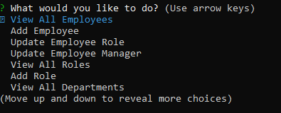
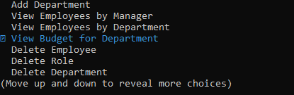

# Employee Tracker

## Description

In this Employee Tracker app, a user can create a business structure by listing and adding Departments, Roles and Employees. Employees can be assigned specific roles and can be managed by another employee. Roles have specific titles and salaries assgined to them, and are connected to specific departments. Departments have specfic names, and are the main connector for all information.

# Installation

Run the console command 'npm i' or 'npm install' to install module dependencies

## Usage

Video of usage can be found at: https://drive.google.com/file/d/13M-7hIItqaKD8-uTE-zU3xF0wOlnWiIV/view

The program is run in the console with the command 'npm run start'

The User can select the following options.

* View all Employees in the company
* Add an Employee while specifing its role and manager
* Update an Employee's role
* Update an Employee's manager
* View all possible Roles
* Add a new Role, specifing its title and salary
* View all Departments

* Add a new Department
* View Employees by Manager
* View Employees by Department
* View the Budget for a Department
* Delete an Employee
* Delete a Role
* Delete a Department

## Credits

Vijay Natarajan (github.com/santoshalper)
